# 👋 Hola, soy Alejandro

💼 Trabajo en Freepik como Full-Stack Developer

🚀 En mis ratos libres, dedico parte de mi tiempo a desarrollar <a href="https://github.com/AstroCorp/Ace-Books" target="_blank">Ace Books</a>, entre otros proyectos que puedes ver en mis repositorios

📚 Actualmente estoy ampliando mis conocimientos en testing para entregar código confiable y robusto

## 🛠️ Tecnologías con las que trabajo

    
    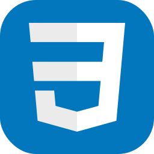
    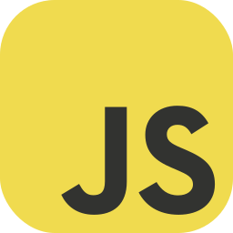
    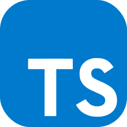
    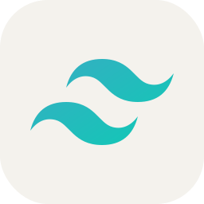
    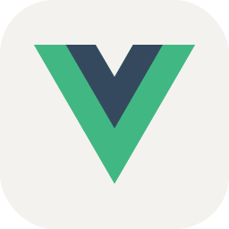
    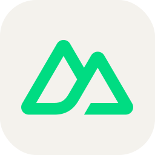
    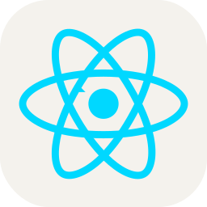
    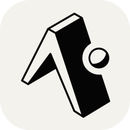
    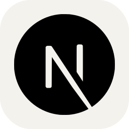
    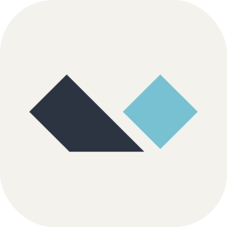
    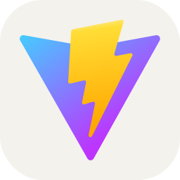
    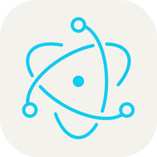
    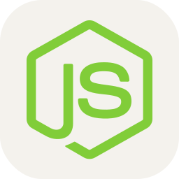
    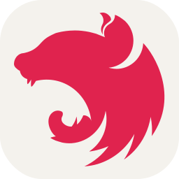
    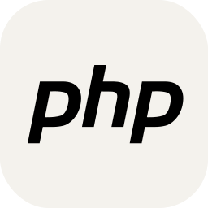
    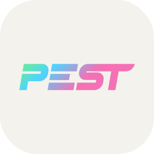
    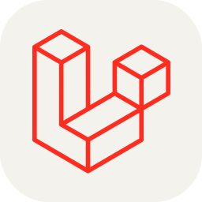
    
    
    
    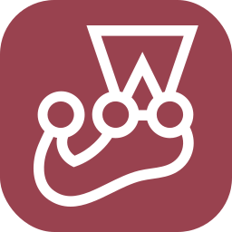
    
    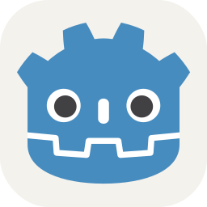
    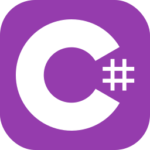
    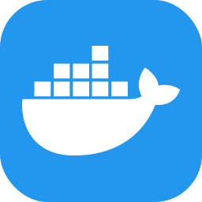
    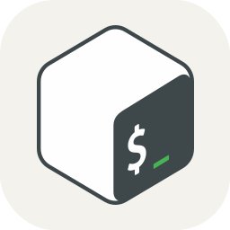
    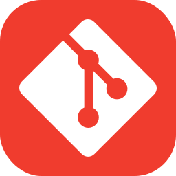
    
    

